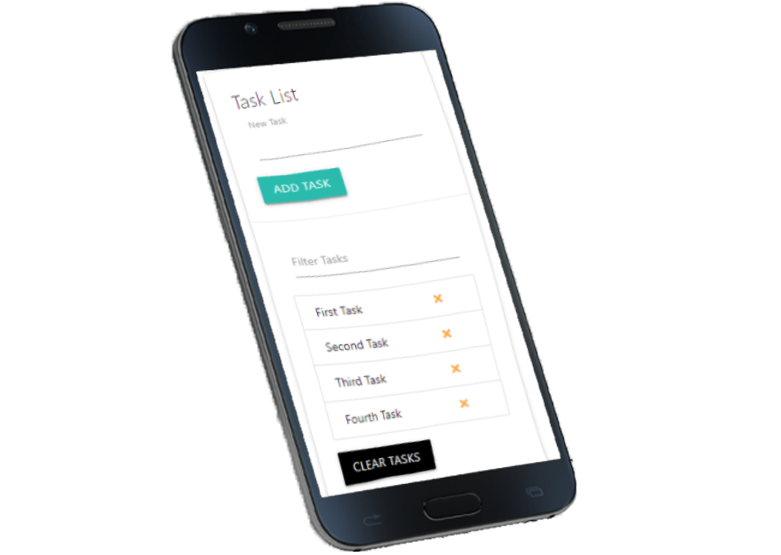
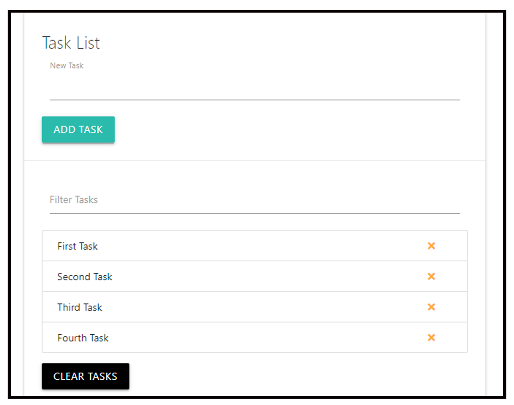

# task-list
>This is a project focus on how to add task, clear task, and filter the tasks using document object model using JS.

### Mobile Version

### Desktop Version

### Built With

- HTML5
- Materialize
- JS

### Live Demo

[Visit the Live Demo](https://debas-31.github.io/hello-Microverse/)

### Authors

👤 **Debas Gebreslasie**

- [GitHub](https://github.com/Debas-31)
- [Twitter](https://twitter.com/DEBSH76956492)
- [LinkedIn](https://www.linkedin.com/in/debas-gebrengus/)

### 🤝 Contributing

Contributions, issues, and feature requests are welcome!

Feel free to check the [issues page](https://github.com/Debas-31/task-list/issues)
### Show your support

Give a ⭐️ if you like this project!

### Acknowledgments
- Traversy Media